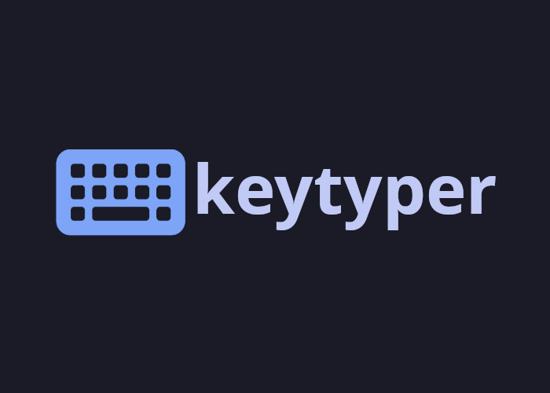

<p aling="center" style="display: flex; width: 100%; flex-direction: row; justify-content: center;">
	
</p>

# Keytyper

Keytyper - это онлайн платформа для изучения и тренировки техники слепой печати. Весь пользовательский интерфейс написан с использованием фреймворка [React](https://react.dev/).

Опробовать платформу, не запуская ее на собственном сервере, можно по [этой ссылке](http://94.181.190.26/10v/skripko/keytyper).

## Установка на локальном сервере

Чтобы запустить данную платформу на локальном сервере необходимо клонировать репозиторий, загрузить необходимые библиотеки, собрать готовую для использования версию и открыть ее на своем сервере.

```sh
$ yarn install # загрузка всех необходимых библиотек
$ yarn start # запуск тестового сервера
$ yarn build # сборка версии, готовой для использования на прод сервере
```

Также данная платформа использует отдельный сервер для обращения к базе данных и поддержания постоянного асинхронного подключения пользователей к комнатам. Сервер можно скачать из его [репозитория](https://codeberg.org/katsuki/keytyper-backend).
